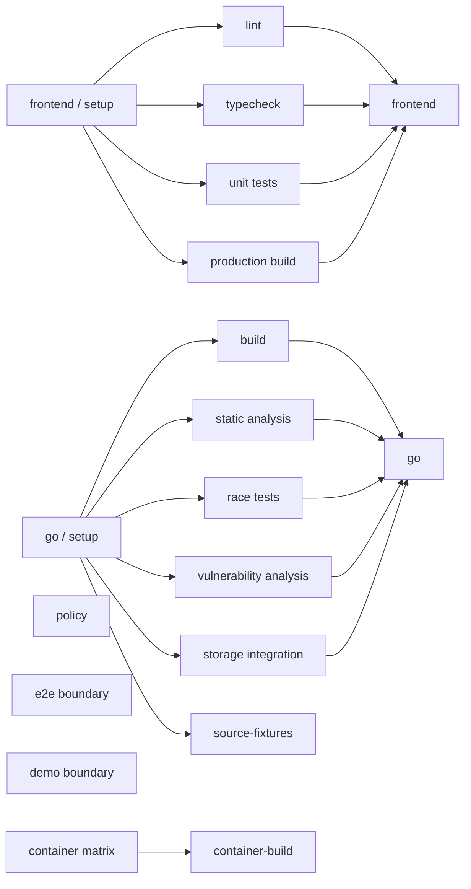

# ADR-011: Parallel GitHub Actions with stable aggregate checks

Status: Accepted
Date: 2026-08-29

## Context

The initial CI workflow grouped all frontend and Go gates into two serial jobs.
It also made the demo and placeholder browser boundary wait for unrelated build
jobs. The first staging run exposed an undeclared ripgrep dependency on the
GitHub-hosted runner and confirmed that CodeQL uploads are unavailable for this
private repository's current plan.

GitHub runs jobs in parallel unless `needs` creates a dependency. Matrix jobs
maximize available runner concurrency, but private-repository job time rounds
up by job, so splitting every short command would waste the included quota.
Path-filtered required workflows may remain pending and block merges.

## Decision

Follow the proven structure in the owner's QuantHelm repository, adapted to
Relantern's smaller stack:

- Use `frontend / setup` and `go / setup` as dependency-integrity gates that
  populate the official setup-action caches before parallel fan-out.
- Run frontend lint, typecheck, unit tests, and production build in parallel.
- Run Go build, static analysis, race tests, vulnerability analysis, and the
  disposable MinIO storage integration in parallel.
- Preserve stable aggregate checks named `frontend` and `go`, plus the exact
  policy, database, contract, source, security, container, browser, and demo
  names required by the build specification.
- Keep only real cache or result dependencies in `needs`; source, demo,
  container, and browser-boundary checks start immediately.
- Use one checksum-verified ripgrep installer for runner portability and a
  local composite action for pinned Node, pnpm, and Go setup.
- Keep CodeQL and dependency review in dedicated workflows. Gate them with
  `CODEQL_AVAILABLE` and `DEPENDENCY_REVIEW_AVAILABLE` repository variables so
  unsupported private-plan features skip honestly instead of failing after
  consuming runner minutes.
- Apply least-privilege token permissions, full-SHA action pins with release
  comments, `persist-credentials: false`, explicit timeouts, and stale-PR
  concurrency cancellation.
- Restrict repository Actions permissions to GitHub-owned actions plus the
  exact pnpm and Docker action families in use, and require full commit SHA
  references at the GitHub settings layer.
- Do not use path filters on workflows intended to become required checks.

## Job graph

The policy, browser-boundary, demo, and container checks start immediately
alongside both setup gates. Database, storage, security, and source-fixture
jobs depend only on `go / setup`; contract drift depends on both setup gates so
it restores warm Go and pnpm caches. Storage joins the stable `go` aggregate so
an S3 regression cannot be hidden by otherwise green unit checks.

## Consequences

The expensive independent gates fan out after one warm-cache setup, and a
failure does not conceal sibling results. The graph remains below the current
GitHub Free limit of 20 concurrent jobs. More jobs consume some additional
rounded minutes, but warm caches and grouping sub-minute policy checks avoid an
unbounded cost increase.

Rulesets for private repositories are unavailable on the current plan. The
stable aggregate names are ready for the Section 22 ruleset when the plan
supports it; the repository must not claim enforcement before then. Enabling
either gated security workflow requires setting its availability variable only
after the corresponding GitHub feature is enabled.

## References

- [GitHub workflow syntax](https://docs.github.com/en/actions/reference/workflows-and-actions/workflow-syntax)
- [GitHub Actions concurrency](https://docs.github.com/en/actions/concepts/workflows-and-actions/concurrency)
- [GitHub dependency caching](https://docs.github.com/en/actions/reference/workflows-and-actions/dependency-caching)
- [GitHub secure use reference](https://docs.github.com/en/actions/reference/security/secure-use)
- [GitHub Actions limits](https://docs.github.com/en/actions/reference/limits)
- [GitHub skipped workflow behavior](https://docs.github.com/en/actions/how-tos/manage-workflow-runs/skip-workflow-runs)
- [GitHub CodeQL setup types](https://docs.github.com/en/code-security/concepts/code-scanning/setup-types)
- [QuantHelm CI reference](https://github.com/traweezy/quanthelm/blob/staging/.github/workflows/ci.yml)
